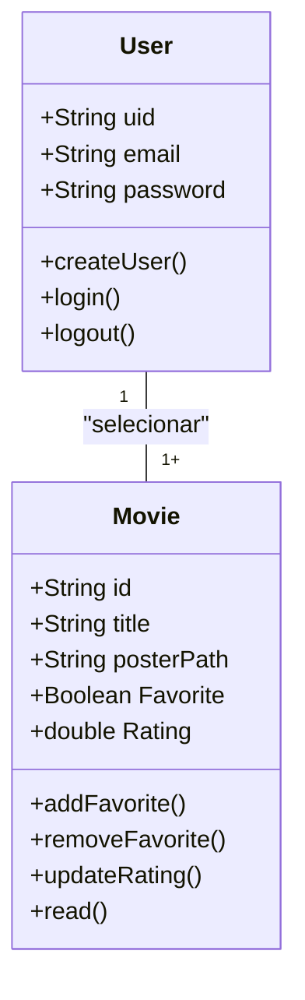
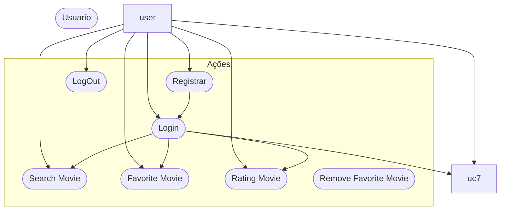

# CineFavorite - Formativa
Construindo um aplicativo do Zero - O CineFavorite permitirá criar uma conta e buscar filmes em uma api e montar uma galeria pessoal de filmes favoritos, com capas e notas.

## Objetivos
- Integrar o Aplicativo a uam API
- Criar uma conta pessoal no FireBase
- Armazenar informações para Cada usuários das preferencias solicitadas
- consultar informações de Filmes (Capas, Título)

## Levantamentos de Requisitos

- Funcionais

- Não Funcionais

## Diagramas

1. ### Diagrama de Classe
    Diagrama de que demonstra as entidades da aplicação

    - usuário (user) : classe criada pelo FireBase
        - email
        - senha
        - id
        - create()
        - login()
        - logout()

    - Filme (Movie) : Classe modelada pelo dev
        - number id:
        - String titulo:
        - String PosterPath
        - boolean favorito
        - double Nota
        - adicionar()
        - update()
        - remover()
        - listarFavoritos()


 2. ### Diagrama de Uso

Ações que o Atores fazem

- Usúario:
- Registrar
- Login
- Logout
- Buscar filmes na API  
- Adicionar aos Favoritos
- Dar nota ao filmes
- Remover dos Favoritos




 3. ### Diagrama de Fluxo

Determina o caminho que o ator percorre para realizar uma ação

- Ação de Login

```mermaid

A[Inicio] -->B{Tela de Login}
B -->C[Inserir email e senha]
C -->D[Validar as Credenciais do Usuario]
D -->SIM --> E[Tela de favoritos]
D -->Não --> F[Mensagem de Erro]

```

## Prototipagem

-- o Link do figma 
https://www.figma.com/design/Ef8i8DwEmk4RRhRDk9Jqwe/Untitled?node-id=0-1&t=DiWU1UKUDnZTi8sQ-1

## Codificação
